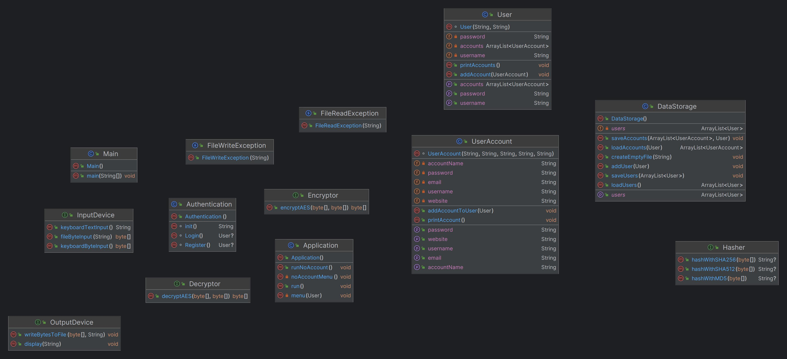

# Privacy Friend

Welcome to Privacy Friend, your digital guardian in an increasingly connected world. This application is dedicated to empowering you with tools to safeguard your digital existence. Let's delve into what makes Privacy Friend your go-to privacy companion.

## Overview

Privacy Friend stands as a fortress against digital threats, offering encryption and hashing capabilities using cutting-edge algorithms. Whether you're shielding sensitive files during transit or ensuring their integrity post-download, Privacy Friend has your back. Bid farewell to insecure password files - our app provides a secure vault for your credentials.

## Why Privacy Friend?

In an era dominated by the online realm, our lives and identities are intricately woven into the digital fabric. The motivation behind Privacy Friend is rooted in the recognition of the ever-growing digital landscape and the imperative need to fortify ourselves against potential threats.

## Requirements

### Diagrams Speak Louder Than Words

Dive into Privacy Friend's architecture through the visual aid of our class diagram. It encapsulates the essence of the application's structure and functionality.

### Files: The Silent Guardians of Data

Privacy Friend believes in the resilience of information stored in files. Explore how the application deftly manages and retrieves data, ensuring a seamless user experience.

### Commanding with Arguments

Privacy Friend embraces efficiency with the use of program arguments. Learn how to wield this command-line power for a personalized user experience.

### Handling the Unexpected

Exception handling is an art, and Privacy Friend is no stranger to it. Encounter and overcome challenges with our adept handling of exceptions, from array bounds to unexpected file behaviors.

### Exceptions Crafted for You

Privacy Friend introduces two bespoke exceptions - FileWriteException and FileReadException. Unveil the stories they tell when the intricacies of file interactions take an unexpected turn.

### Input Validation: Navigating the Digital Maze

Navigate Privacy Friend's menu with confidence. Every digit you input is scrutinized and validated, ensuring a smooth and secure user interaction.

## Getting Started

Privacy Friend is more than an application; it's a commitment to your digital security. Clone this repository, embark on the journey, and fortify your digital presence with Privacy Friend.

Your Privacy, Our Priority.